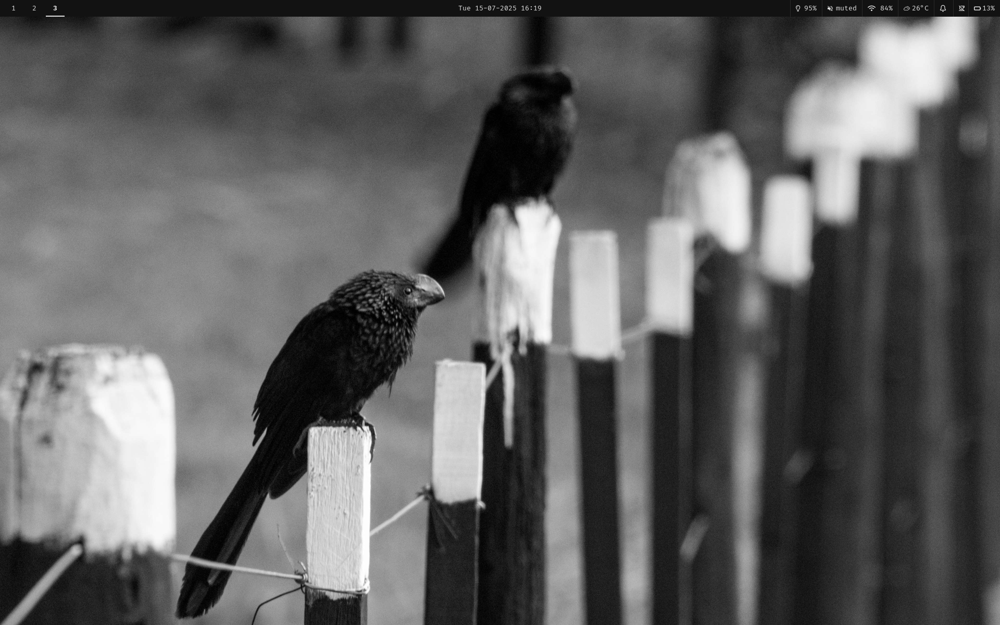

# These are my dotfiles!
Here are all my dotfiles, they are set up for stow. To use them you need to install stow (included in the package list). 
Clone the repo to your homefolder. 

You can install the packages I use for this setup using `sudo pacman -S --needed - < pkglist.txt` Do the same with aur packages using an aur helper.

Go into the cloned repo, then run the command `stow .`

To get the wallpaper i use, run this command: `mkdir ~/dotfiles/wallpapers && wget -O ~/dotfiles/wallpapers/dracula.jpg https://wallpapercave.com/wp/wp11620668.jpg`
## Preview

## Theme

The GTK theme included in this repo is [Dracula GTK](https://draculatheme.com/gtk), licensed under the [GPL-3.0 License](https://www.gnu.org/licenses/gpl-3.0.html).
